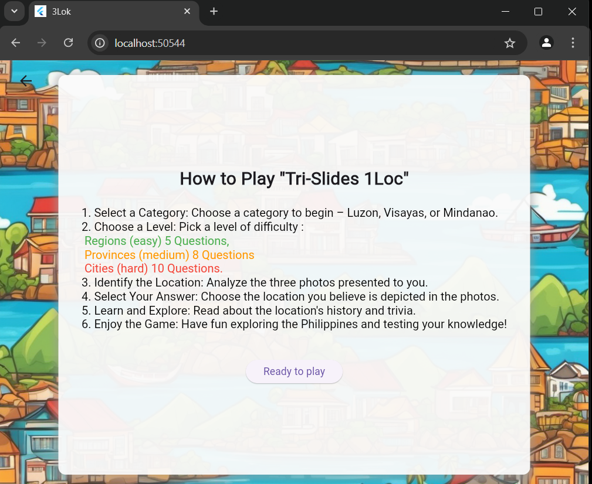

# Tri-Slides 1Loc

Tri-Slides 1Loc is a Flutter game app that challenges users to test their knowledge of Philippine geography. Through interactive and engaging levels, players explore various regions, provinces, and cities while learning about each location's history and trivia.

## Table of Contents
- [Installation](#installation)
- [Gameplay Instructions](#gameplay-instructions)
- [Screenshots](#screenshots)
- [Features](#features)
- [Future Improvements](#future-improvements)
- [Contributing](#contributing)
- [License](#license)

## Installation

To install and run the Tri-Slides 1Loc app locally, follow these steps:

1. **Clone the Repository**
   ```bash
   git clone https://github.com/your-username/tri-slides-1loc.git
   cd 3Lok
2. **Install Dependencies**
   ```bash
   flutter pub get
3. **Run the App
   ```bash
   flutter run
## Gameplay Instructions

### How to Play "Tri-Slides 1Loc"

1. **Select a Category**  
   Choose a category to begin:
   - **Luzon**
   - **Visayas**
   - **Mindanao**

2. **Choose a Level**  
   Select a difficulty level:
   - **Regions (Easy):** 5 questions.
   - **Provinces (Medium):** 8 questions.
   - **Cities (Hard):** 10 questions.

3. **Identify the Location**  
   Examine the three photos provided to figure out which location they depict.

4. **Select Your Answer**  
   Pick the location that you think is shown in the images.

5. **Learn and Explore**  
   After selecting your answer, read about the location's history and interesting trivia.

6. **Enjoy the Game**  
   Have fun while enhancing your knowledge of the Philippines!

## Screenshots




*Gameplay screenshots*

## Features

- **Multiple Difficulty Levels:** Choose from easy, medium, and hard levels based on regions, provinces, or cities.
- **Educational Content:** Learn fun facts and historical details about each location.
- **Interactive Gameplay:** Test your knowledge and explore the Philippines visually.

## Future Improvements

- **Multiplayer Mode:** Add a feature to challenge friends in real-time.
- **Additional Categories:** Include landmarks, natural wonders, and cultural icons.
- **Leaderboard:** Track high scores and compare with other players.

## Contributing

Contributions are welcome! If you want to improve this app, please follow these steps:

1. **Fork the repository.**
2. **Create a new branch** with a descriptive name.
3. **Make your changes** and commit them with clear messages.
4. **Submit a pull request.**

## License

This project is licensed under the MIT License - see the [LICENSE](LICENSE) file for details.
